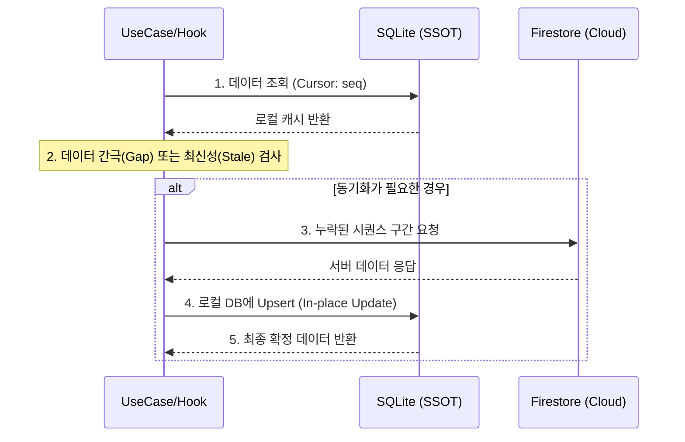

# PandyTalk - Local-First Chat App

👉 **Live App (Android)**: Google Play – [PandyTalk](https://play.google.com/store/apps/details?id=com.cshchatapp)  
👉 **Detailed Engineering Log**: [Notion](https://www.notion.so/Engineering-Log-30159549cbc0800286f9faf3a378fda2?pvs=12)

네트워크 지연을 최소화하고 오프라인에서도 끊김 없는 사용자 경험을 제공하기 위해 **SQLite 기반 Local-First 아키텍처**로 설계된 채팅 앱입니다.

---

## 📊 Performance Results

| 지표          | Firestore (Cloud) | SQLite (Local)         | 개선 결과        |
| :------------ | :---------------- | :--------------------- | :--------------- |
| **로딩 속도** | ~286.74ms         | **~9.24ms**            | **약 31배 향상** |
| **안정성**    | 낮음 (최대 535ms) | **매우 높음 (±1.5ms)** | 일관된 UX 제공   |

> _참고: 위 수치는 특정 테스트 환경의 측정 결과로, 절대적인 수치보다는 로컬 DB 도입 전후의 상대적인 성능 차이를 확인하기 위한 참고용 데이터입니다._

---

## ✨ Core Features & Key Logic

### 1. 스마트 데이터 동기화 (Smart Sync)

서버와 로컬의 데이터를 비교하여 누락된 메시지만 골라 빠르게 동기화합니다. 불필요한 데이터 전송을 줄여 성능을 최적화했습니다.

- [🔗 messageService.getChatMessages (통합 조회 로직)](app/features/chat/service/messageService.ts)
- [🔗 useChatMessagesInfinite (인피니트 쿼리 연동)](app/features/chat/hooks/useChatMessagesInfinite.ts)

### 2. Local-First 데이터 구조

모든 데이터의 기준을 로컬 DB에 두어 네트워크 의존성을 제거하고 오프라인 사용성을 확보했습니다.

- [🔗 messageLocal.sqlite.ts (SQLite CRUD)](app/features/chat/data/messageLocal.sqlite.ts)
- [🔗 messageRemote.firebase.ts (Firestore 연동)](app/features/chat/data/messageRemote.firebase.ts)

### 3. 공용 폼 엔진 (InputForm)

JSON 설정 기반으로 복잡한 폼을 선언적으로 관리하며, 유효성 검사 및 데이터 바인딩을 자동화하여 공통 UI의 생산성을 높였습니다.

- [🔗 InputForm.tsx (선언적 폼 엔진)](app/shared/ui/form/InputForm.tsx)
- [🔗 useInputForm (폼 상태 및 검증 훅)](app/shared/ui/form/hooks/useInputForm.ts)

### 4. 커스텀 채팅 훅 (Chat Hooks)

복잡한 채팅 비즈니스 로직(메시지 전송, 이미지 업로드, 방 생성 등)을 훅으로 분리하여 관리합니다.

- [🔗 useChatMessageInput (메시지 입력 및 전송 로직)](app/features/chat/hooks/useChatMessageInput.ts)

---

## 🚀 Technical Deep Dive

### 1. Local-First 동기화 전략 (Sync Flow)

단순 조회가 아닌, 로컬 상태를 기준으로 필요한 데이터만 서버에서 선별적으로 가져오며 유저에게 막힘없는 경험을 제공합니다.



### 2. 안정적인 SQLite 트랜잭션 관리 (Concurrency & Mutex)

React Native의 비동기 환경에서 SQLite 데이터가 꼬이는 것을 방지하기 위해 **Mutex 기반의 락(Lock) 서비스**를 구현했습니다. 특히 테이블 재생성(Migration) 중 쿼리가 실행되어 앱이 크래시되는 것을 방지하기 위해 `sqliteCall` 래퍼를 통해 실행 순서를 직렬화했습니다.

- [🔗 sqliteCall.ts (직렬화 실행 래퍼)](app/shared/sqlite/sqliteCall.ts)

### 3. 정량적 성능 최적화

모든 주요 데이터 액션의 레이턴시를 `usePerformanceMeasure`로 정량 측정합니다. 이 데이터를 기반으로 Firestore 직접 호출 대비 SQLite 조회가 **약 31배 빠르다는 수치**를 도출했으며, 성능 병목 없는 아키텍처를 유지하고 있습니다.

- [🔗 usePerformanceMeasure.ts (성능 측정 훅)](app/shared/hooks/usePerformanceMeasure.ts)

---

## 🧰 Tech Stack

- **Frontend**: React Native, TypeScript
- **State**: React Query, Redux
- **Database**: SQLite, Firebase Firestore
- **Backend**: Firebase Cloud Functions, FCM

---

## 🗂 Project Structure

도메인(Feature) 단위로 로직을 캡슐화하여 유지보수성을 높인 **Feature-based Architecture**를 채택했습니다.

```bash
app
├─ bootstrap          # Native 연동 및 앱 초기화 (Firebase, SQLite 등)
├─ features           # 도메인 중심의 서비스 로직 및 UI
│  ├─ chat            # 핵심 채팅 엔진 (Sync Service, Message Hooks, Layered Data)
│  ├─ auth            # 가입/로그인 및 세션 관리
│  ├─ notification    # FCM 및 내부 알림 시스템
│  └─ user            # 프로필 및 유저 컨텍스트
├─ shared             # 전역 재사용 인프라 및 UI Kit
│  ├─ sqlite          # Local-First의 핵심인 SQLite SSOT 관리
│  ├─ firebase        # Firestore Remote 클라이언트
│  ├─ ui              # 공용 시각 요소 (InputForm 엔진, 공용 버튼 등)
│  └─ utils           # 시간 변환, 포맷터 등 유틸리티
├─ navigation         # 권한별 화면 라우팅 정책
└─ store              # 서버 상태 외의 최소한의 앱 전역 상태(Redux)
```
