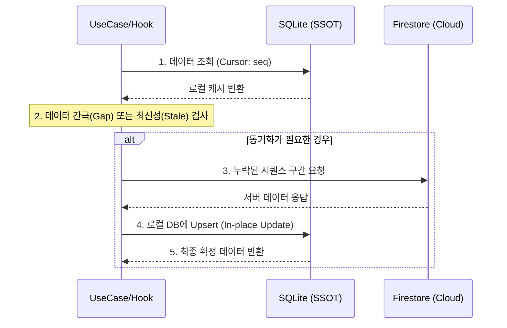
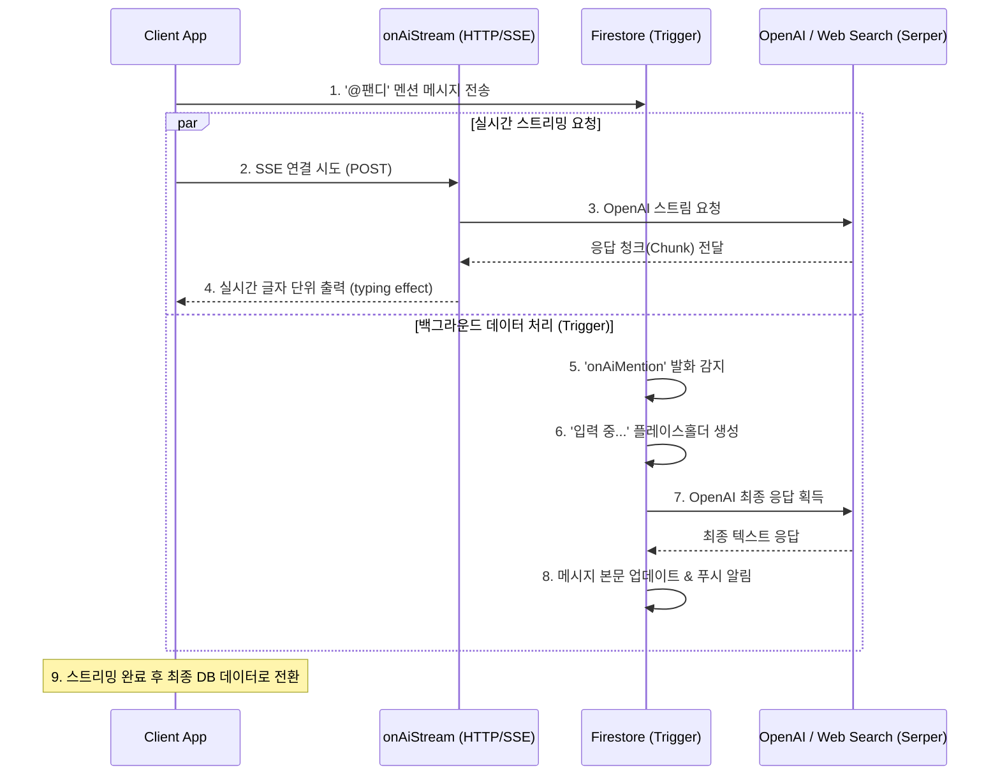

# PandyTalk - Local-First Chat App

👉 **Live App (Android)**: Google Play – [PandyTalk](https://play.google.com/store/apps/details?id=com.cshchatapp)  
👉 **Detailed Engineering Log**: [Notion](https://www.notion.so/Engineering-Log-30159549cbc0800286f9faf3a378fda2?pvs=12)

**SQLite 기반 Local-First 아키텍처**로 오프라인에서도 끊김 없이, 실시간 웹 검색 기능을 갖춘 **AI 비서(@팬디)와 함께 그룹 및 DM 채팅**을 즐길 수 있는 지능형 채팅 서비스입니다.

---

## 📊 Performance Results

| 지표          | Firestore (Cloud) | SQLite (Local)         | 개선 결과        |
| :------------ | :---------------- | :--------------------- | :--------------- |
| **로딩 속도** | ~286.74ms         | **~9.24ms**            | **약 31배 향상** |
| **안정성**    | 낮음 (최대 535ms) | **매우 높음 (±1.5ms)** | 일관된 UX 제공   |

> _참고: 위 수치는 특정 테스트 환경의 측정 결과로, 절대적인 수치보다는 로컬 DB 도입 전후의 상대적인 성능 차이를 확인하기 위한 참고용 데이터입니다._

**측정 방법**: 채팅 메시지 조회 액션을 `performance.now()` 기반의 커스텀 측정 훅으로 감싸 Firestore 직접 조회 경로와 SQLite 로컬 조회 경로의 응답 시간을 비교했습니다. 동일한 사용자 흐름에서 측정 태그별 로그를 남겨 평균 지연 시간뿐 아니라 최대 지연과 편차를 함께 확인했습니다.

- [🔗 usePerformanceMeasure.ts (성능 측정 훅)](app/shared/hooks/usePerformanceMeasure.ts)

---

## ✨ Core Features & Key Logic

### 1. 데이터 동기화

서버와 로컬의 데이터를 비교하여 누락된 메시지만 골라 빠르게 동기화합니다. 불필요한 데이터 전송을 줄여 성능을 최적화했습니다.

- [🔗 messageService.getChatMessages (통합 조회 로직)](app/features/chat/service/messageService.ts)
- [🔗 useChatMessagesInfinite (인피니트 쿼리 연동)](app/features/chat/hooks/useChatMessagesInfinite.ts)

### 2. Local-First 데이터 구조

모든 데이터의 기준을 로컬 DB에 두어 네트워크 의존성을 제거하고 오프라인 사용성을 확보했습니다.

- [🔗 messageLocal.sqlite.ts (SQLite CRUD)](app/features/chat/data/messageLocal.sqlite.ts)
- [🔗 messageRemote.firebase.ts (Firestore 연동)](app/features/chat/data/messageRemote.firebase.ts)

### 3. 하이브리드 AI 스트리밍

AI 봇(@팬디)과의 대화에서 즉각적인 반응(SSE)과 영구적인 기록(Firestore)을 동시에 제공하는 하이브리드 방식을 채택했습니다.

- [🔗 onAiMention (봇 응답 및 데이터 수명 주기 관리)](functions/src/triggers/chats/onAiMention.ts)
- [🔗 onAiStream (실시간 SSE 스트리밍)](functions/src/triggers/chats/onAiStream.ts)
- [🔗 AiStreamingText (스트리밍 통합 UI 컴포넌트)](app/features/chat/components/AiStreamingText.tsx)

### 4. 공용 폼 엔진 (InputForm)

JSON 설정 기반으로 복잡한 폼을 선언적으로 관리하며, 유효성 검사 및 데이터 바인딩을 자동화하여 공통 UI의 생산성을 높였습니다.

- [🔗 InputForm.tsx (선언적 폼 엔진)](app/shared/ui/form/InputForm.tsx)
- [🔗 useInputForm (폼 상태 및 검증 훅)](app/shared/ui/form/hooks/useInputForm.ts)

---

## 🚀 Technical Deep Dive

### 1. Local-First 동기화 전략 (Sync Flow)

단순 조회가 아닌, 로컬 상태를 기준으로 필요한 데이터만 서버에서 선별적으로 가져오며 유저에게 막힘없는 경험을 제공합니다.



### 2. 하이브리드 AI 아키텍처 (Hybrid AI Streaming)

단순한 요청-응답 방식이 아니라, 사용자 경험을 극대화하기 위해 **실시간 스트리밍(SSE)**과 **데이터베이스 영속성(Trigger)**을 분리하여 처리합니다.



- **관점의 분리**: `onAiStream`은 오직 클라이언트의 시각적 경험(실시간 스트리밍)에만 집중하며, `onAiMention`은 데이터의 무결성(DB 저장, 푸시 알림, 시퀀스 번호 관리)을 책임집니다.
- **웹 검색 엔진 통합**: Serper API를 연동하여 AI가 최신 웹 정보를 검색하고 답변에 반영할 수 있는 Function Calling 기능을 갖추고 있습니다.

---

## 🧰 Tech Stack

| 분류 | 기술 | 용도 |
|---|---|---|
| **Frontend** | React Native, TypeScript | 크로스플랫폼 앱 |
| **UI** | React Native Paper | 디자인 시스템 |
| **Server State** | React Query | 캐싱, 인피니트 쿼리 |
| **Client State** | Redux Toolkit | 인증 세션 등 전역 상태 최소화 |
| **Local DB** | SQLite (SSOT) | 오프라인 우선, 빠른 조회 |
| **Remote DB** | Firebase Firestore | 실시간 동기화 |
| **AI** | OpenAI GPT-4o, Serper API | AI 봇 응답 + 웹 검색 |
| **Backend** | Firebase Cloud Functions | AI 트리거, 푸시 알림 |
| **Push** | FCM | 메시지 알림 |
| **배포** | EAS Build + EAS Update | CI/CD, OTA 업데이트 |

---

## ⚙️ Getting Started

### Pre-requisites
- [Node.js](https://nodejs.org/) (v18+)
- [Yarn](https://yarnpkg.com/)
- [Android Studio](https://developer.android.com/studio) & Android SDK (for Android Emulation)
- [Firebase Project](https://console.firebase.google.com/) (Firestore, Auth, Functions 활성화 필요)

### Installation
```bash
# Repository 클론
git clone https://github.com/951jth/pandytalk.git
cd pandytalk

# 의존성 설치
yarn install
```

### Environment Setup
1. Firebase 프로젝트에서 `google-services.json` (Android) 파일을 다운로드하여 `android/app/` 경로에 배치합니다.
2. `.env` 파일에 필요한 API Key들을 설정합니다. (OpenAI, Serper 등)

### Execution
```bash
# Android 실행 (에뮬레이터 또는 기기 연결 필요)
yarn android

# 메트로 번들러만 실행할 경우
yarn start

# 캐시 초기화가 필요한 경우
yarn start --reset-cache
```

---

## 🗂 Project Structure

도메인(Feature) 단위로 로직을 캡슐화하여 유지보수성을 높인 **Feature-based Architecture**를 채택했습니다.

```bash
app
├─ bootstrap          # Native 연동 및 앱 초기화 (Firebase, SQLite 등)
├─ features           # 도메인 중심의 서비스 로직 및 UI
│  ├─ chat            # 핵심 채팅 엔진 (Sync Service, Message Hooks, Layered Data)
│  ├─ auth            # 가입/로그인 및 세션 관리
│  ├─ notification    # FCM 및 내부 알림 시스템
│  └─ user            # 프로필 및 유저 컨텍스트
├─ shared             # 전역 재사용 인프라 및 UI Kit
│  ├─ sqlite          # Local-First의 핵심인 SQLite SSOT 관리
│  ├─ firebase        # Firestore Remote 클라이언트
│  ├─ ui              # 공용 시각 요소 (InputForm 엔진, 공용 버튼 등)
│  └─ utils           # 시간 변환, 포맷터 등 유틸리티
├─ navigation         # 권한별 화면 라우팅 정책
└─ store              # 서버 상태 외의 최소한의 앱 전역 상태(Redux)
```
