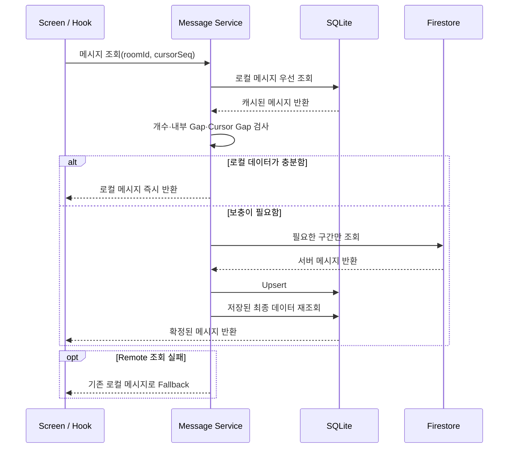
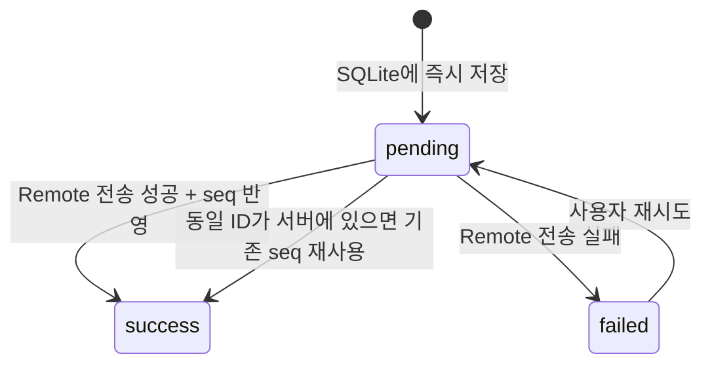
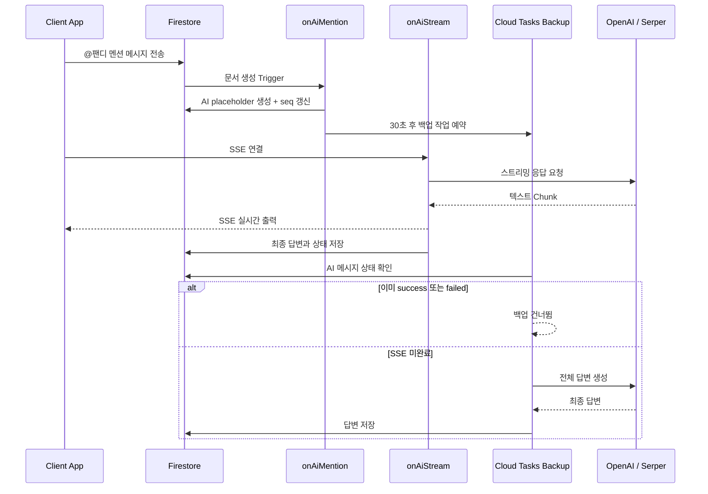
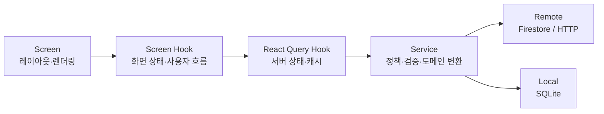

# PandyTalk - Local-First Chat App

> 오프라인에서도 대화 내역을 즉시 조회하고, AI 답변을 실시간으로 받아볼 수 있는 Local-First 채팅 앱

[Google Play에서 PandyTalk 보기](https://play.google.com/store/apps/details?id=com.cshchatapp) · [상세 Engineering Log](https://www.notion.so/Engineering-Log-30159549cbc0800286f9faf3a378fda2?pvs=12)

PandyTalk은 그룹 채팅과 DM에 AI 비서 `@팬디`를 결합한 React Native 채팅 서비스입니다. 채팅 메시지는 SQLite를 우선 조회해 네트워크 상태와 관계없이 빠르게 표시하고, 필요한 데이터만 Firestore에서 보충합니다. AI 답변은 SSE로 스트리밍하되, 연결이 완료되지 않는 상황까지 Cloud Tasks 기반 백업 처리로 복구합니다.

## 핵심 성과

| 해결한 문제 | 적용한 방식 | 결과 |
| :--- | :--- | :--- |
| 채팅방 진입 시 네트워크 조회 지연 | SQLite 우선 조회와 선택적 Firestore 동기화 | 개발 환경 5회 측정에서 Firestore 직접 조회 평균 **286.74ms**, warm SQLite 조회 평균 **9.24ms** 관찰 |
| AI 전체 답변이 끝날 때까지 기다리는 UX | HTTP/SSE 스트리밍 | 격리 실험 6회에서 SSE 첫 content chunk 평균 **771.17ms**, non-stream 전체 완료 평균 **2,511.84ms** 측정 |
| SSE 연결 중단 시 AI 답변이 유실될 가능성 | Firestore 상태와 Cloud Tasks 백업 처리 | 미완료 응답을 백업 태스크로 처리 |
| 메시지 전송 실패 시 불명확한 UI 상태 | SQLite 기반 `pending → success/failed` 상태 관리 | 즉시 표시, 실패 안내, 동일 메시지 재전송 지원 |

> 성능 수치는 제한된 개발 환경의 소표본 측정 결과입니다. SQLite 수치는 원격 조회와 warm local 조회의 경로 차이를, AI 수치는 non-stream 전체 완료와 SSE 첫 chunk의 체감 시점 차이를 비교합니다. 절대 성능이나 동일 조건의 처리량 향상을 의미하지 않습니다.

## 주요 기능

- 그룹 채팅 및 1:1 DM
- SQLite 기반 오프라인 대화 조회
- Firestore 실시간 메시지 구독 및 누락 데이터 동기화
- 텍스트·다중 이미지 메시지 전송
- 메시지 전송 상태 표시와 실패 메시지 재시도
- `@팬디` 멘션 기반 AI 답변
- SSE 기반 AI 답변 스트리밍
- Serper API를 활용한 AI 웹 검색
- FCM 메시지 알림
- EAS Update 기반 OTA 업데이트

## Engineering Highlights

### 1. Local-First 메시지 조회

Firestore를 매번 직접 조회하면 채팅방 진입과 과거 메시지 탐색이 네트워크 상태에 영향을 받습니다. PandyTalk은 사용자에게 보여줄 메시지를 SQLite에서 먼저 조회하고, 로컬 데이터가 부족하거나 시퀀스 간극이 발견될 때만 Firestore를 호출합니다.



핵심 정책은 다음과 같습니다.

- 로컬 페이지가 충분하고 `seq`가 연속적이면 Firestore를 호출하지 않습니다.
- 페이지 내부 Gap 또는 cursor 시작점의 Gap을 감지하면 서버 데이터로 보충합니다.
- 서버에서 가져온 데이터도 곧바로 반환하지 않고 SQLite에 저장한 뒤 다시 조회합니다.
- 네트워크 조회가 실패해도 기존 로컬 메시지를 반환해 대화 조회를 막지 않습니다.
- 최신 메시지 Gap이 100개를 넘으면 전체를 한 번에 채우지 않고 최신 50개를 우선 확보합니다.

관련 코드:

- [`messageService.getChatMessages`](app/features/chat/service/messageService.ts)
- [`messageLocal.sqlite.ts`](app/features/chat/data/messageLocal.sqlite.ts)
- [`messageRemote.firebase.ts`](app/features/chat/data/messageRemote.firebase.ts)
- [`useChatMessagesInfinite`](app/features/chat/hooks/useChatMessagesInfinite.ts)

### 2. 실패 상태까지 고려한 메시지 전송

메시지를 서버 응답 이후에만 표시하면 사용자는 전송 버튼을 누른 뒤 네트워크 왕복을 기다려야 합니다. PandyTalk은 메시지를 SQLite에 `pending` 상태로 먼저 저장해 즉시 표시하고, Remote 결과에 따라 상태와 서버 `seq`를 갱신합니다.



- 서버 전송이 성공한 뒤 로컬 상태 저장이 실패하더라도 전송 자체를 실패로 되돌리지 않습니다.
- 실패 처리 시 현재 상태가 `pending`인 메시지만 `failed`로 변경해 늦게 도착한 결과가 성공 상태를 덮지 않게 합니다.
- 재시도에서는 동일한 메시지 ID를 사용하고, 서버에 이미 저장된 메시지라면 기존 `seq`를 반영합니다.
- 실시간 수신 메시지는 SQLite 저장에 실패하더라도 화면 callback으로 전달해 현재 사용자의 대화를 막지 않습니다.

관련 코드:

- [`sendChatMessageWithRemote`](app/features/chat/service/messageService.ts)
- [`useChatMessageUpsertMutation`](app/features/chat/hooks/useChatMessageUpsertMutation.ts)
- [`ChatMessageStatusIcon`](app/features/chat/components/ChatMessageStatusIcon.tsx)

### 3. SSE와 백업 태스크를 결합한 AI 응답

AI 답변은 전체 생성 완료를 기다리면 첫 화면 출력이 늦어집니다. 반대로 클라이언트 SSE 연결에만 의존하면 앱 종료나 네트워크 단절 시 답변이 영구 저장되지 않을 수 있습니다.

PandyTalk은 실시간 경험과 실패 복구를 다음 흐름으로 결합했습니다.



역할을 다음과 같이 분리했습니다.

- `onAiMention`: 멘션 감지, AI placeholder와 sequence 생성, 백업 작업 예약
- `onAiStream`: SSE 전송, 연결 중단 감지, 생성된 최종 텍스트 저장
- `onAiStreamBackup`: SSE 미완료 상태 확인 및 답변 대체 생성
- `AiStreamingText`: 수신한 작은 chunk를 자연스러운 타이핑 UI로 표시

관련 코드:

- [`onAiMention`](functions/src/triggers/chats/onAiMention.ts)
- [`onAiStream`](functions/src/triggers/chats/onAiStream.ts)
- [`onAiStreamBackup`](functions/src/triggers/chats/onAiStreamBackup.ts)
- [`useAiStreamResponse`](app/features/chat/hooks/useAiStreamResponse.ts)
- [`AiStreamingText`](app/features/chat/components/AiStreamingText.tsx)

### 4. Feature-Based Architecture와 데이터 레이어 분리

기능별 응집도를 유지하면서 UI가 Firebase나 SQLite 구현 세부사항을 직접 알지 않도록 계층을 분리했습니다.



- Screen은 로딩·빈 상태·목록·폼 등 UI 표현에 집중합니다.
- Custom Hook은 화면 상태, 검색, navigation과 여러 query 상태를 조합합니다.
- Service는 권한, 동기화, validation, payload 구성과 오류 변환을 담당합니다.
- Remote와 Local은 외부 저장소 접근과 원시 데이터 반환에 집중합니다.

## 성능 측정

### Firestore 원격 조회와 warm SQLite 조회 비교

개발 환경에서 동일한 채팅 메시지 조회 흐름을 `performance.now()` 기반의 커스텀 측정 훅으로 감싸 Firestore 원격 fetch와 데이터가 저장된 SQLite의 local query를 각각 5회 측정했습니다.

| 지표 | Firestore | SQLite | 결과 |
| :--- | ---: | ---: | :--- |
| 평균 | 286.74ms | 9.24ms | warm local 경로에서 약 31분의 1 수준의 조회 시간 관찰 |
| 최소 | 155.90ms | 7.89ms | - |
| 최대 | 535.88ms | 10.91ms | 원격 조회가 네트워크 상태에 더 크게 영향받는 경향 확인 |

이 비교는 Local-First 조회 경로를 선택하기 위한 방향성 검증입니다.

- SQLite에 데이터가 존재하는 warm path를 측정했으며, cache miss 시 발생하는 Firestore fetch·SQLite save·재조회 전체 시간은 포함하지 않았습니다.
- React Native 목록 렌더링과 사용자가 화면을 인지하기까지의 end-to-end 시간은 포함하지 않았습니다.
- 표본이 각각 5회이고 기기·데이터량·네트워크 조건별 반복 측정이 아니므로 일반적인 성능 수치로 해석하지 않습니다.

- [`usePerformanceMeasure.ts`](app/shared/hooks/usePerformanceMeasure.ts)
- [SQLite 성능 측정 원본](app/features/chat/perpomance.md)

### AI 스트리밍 비교

같은 모델과 프롬프트에서 tool-call과 검색 preflight를 제외하고 `stream: false` 전체 응답 완료 시점과 `stream: true` 첫 content chunk 수신 시점을 6회 비교했습니다. 두 값은 같은 완료 시점의 처리량 비교가 아니라, 사용자가 첫 내용을 볼 수 있는 시점의 차이를 확인하기 위한 지표입니다.

| 측정 시점 | 평균 | 해석 |
| :--- | ---: | :--- |
| non-stream 전체 응답 완료 | 2,511.84ms | 전체 생성이 끝난 뒤 화면에 표시 가능 |
| SSE 첫 content chunk | 771.17ms | 전체 완료 전에 첫 내용을 표시 가능 |
| 두 시점의 평균 차이 | 1,740.67ms | non-stream 전체 완료 대기 시간 대비 69.30% 앞선 시점 |

실제 tool/search 경로를 포함한 별도의 장문 응답 5회 측정에서는 첫 화면 출력이 평균 12.91초, 전체 응답 완료가 평균 23.54초였습니다. 클라이언트가 첫 chunk를 받은 뒤 첫 텍스트를 그리기까지는 평균 31.40ms였습니다. 격리 실험의 771.17ms와 실제 첫 화면 출력의 차이를 통해, 주요 대기 구간이 클라이언트 렌더링보다 tool/search preflight와 OpenAI 첫 token 준비 쪽에 있음을 확인했습니다.

- 생성형 AI 응답은 실행마다 내용과 길이가 달라질 수 있고 표본도 작으므로, 69.30%는 해당 프롬프트와 측정 회차에 한정된 상대적 차이입니다.
- 격리 실험은 스트리밍이 전체 생성 시간을 줄였다는 근거가 아니라, 완료 전 첫 내용을 전달할 수 있음을 확인한 측정입니다.

- [AI 스트리밍 성능 측정 결과](docs/research/ai-stream-performance-results.md)
- [`aiStreamBenchmark.ts`](functions/src/triggers/test/aiStreamBenchmark.ts)
- [`aiPerfLogger.ts`](app/features/chat/utils/aiPerfLogger.ts)

## 테스트 전략

채팅의 핵심 정책은 Service와 Hook 단위 테스트로 검증할 수 있게 구성했습니다.

| 영역 | 주요 검증 시나리오 |
| :--- | :--- |
| Local-First 조회 | 로컬 데이터가 충분하면 Remote 미호출 |
| 동기화 | 데이터 부족, 내부 sequence Gap, cursor Gap 발생 시 서버 보충 |
| 장애 대응 | Remote 오류 발생 시 로컬 데이터 반환 |
| 메시지 전송 | `pending`, `success`, `failed` 전이와 재시도 |
| 정합성 | Remote 성공 후 SQLite 갱신 실패가 전송 실패로 역행하지 않음 |
| 실시간 구독 | 로컬 마지막 `seq`부터 구독하고 SQLite 저장 후 화면 반영 |
| 구독 복구 | 로컬 조회·저장 실패 시에도 구독과 화면 반영 유지 |

관련 테스트:

- [`messageService.test.ts`](app/features/chat/test/messageService.test.ts)
- [`messageLocal.test.ts`](app/features/chat/test/messageLocal.test.ts)
- [`messageRemote.test.ts`](app/features/chat/test/messageRemote.test.ts)
- [`useChatMessagesInfinite.test.ts`](app/features/chat/test/useChatMessagesInfinite.test.ts)
- [`useSubscribeChatMessages.test.ts`](app/features/chat/test/useSubscribeChatMessages.test.ts)

> 이 문서에서는 테스트 파일과 검증 대상을 소개합니다. 특정 커밋의 테스트 통과 여부는 CI 또는 로컬 `yarn verify` 결과로 별도 확인해야 합니다.

## Tech Stack

| 분류 | 기술 | 역할 |
| :--- | :--- | :--- |
| Mobile | React Native 0.81, React 19, TypeScript | Android·iOS 클라이언트 |
| Runtime | Expo 54 Bare Workflow | 네이티브 프로젝트와 Expo 모듈 통합 |
| UI | React Native Paper, FlashList | 디자인 시스템과 채팅 목록 렌더링 |
| Server State | TanStack React Query | 캐시, infinite query, mutation |
| Client State | Redux Toolkit | 인증 세션과 최소 전역 상태 |
| Local DB | SQLite | 메시지 우선 조회와 오프라인 캐시 |
| Remote DB | Firebase Firestore | 메시지 영속화와 실시간 구독 |
| Backend | Firebase Cloud Functions, Cloud Tasks | AI 처리, 이벤트 Trigger, 실패 복구 |
| AI | OpenAI `gpt-4o-mini`, Serper API | AI 답변과 웹 검색 |
| Push | Firebase Cloud Messaging | 메시지 알림 |
| Monitoring | Firebase Analytics, Crashlytics | 사용자 이벤트와 오류 추적 |
| Delivery | EAS Build, EAS Update, GitHub Actions | 빌드·OTA 업데이트 자동화 |

## Project Structure

```text
pandytalk
├─ app
│  ├─ bootstrap               # Firebase·SQLite 등 앱 초기화
│  ├─ features
│  │  ├─ chat                 # 채팅, Local-First 동기화, AI 스트리밍
│  │  ├─ auth                 # 로그인과 인증 정책
│  │  ├─ group                # 그룹 생성과 관리
│  │  ├─ notification         # 알림 설정과 처리
│  │  └─ user                 # 프로필과 사용자 정보
│  ├─ navigation              # 인증·권한별 화면 라우팅
│  ├─ shared
│  │  ├─ firebase             # Firebase 공용 인프라
│  │  ├─ sqlite               # SQLite 연결과 공용 처리
│  │  ├─ ui                   # 재사용 UI 컴포넌트
│  │  └─ utils                # 공용 변환·검증 유틸리티
│  └─ store                   # 최소 전역 클라이언트 상태
├─ functions
│  └─ src
│     ├─ triggers             # Firestore·HTTP·Task 함수
│     └─ services             # AI·알림 도메인 로직
├─ docs
│  ├─ arch                    # 설계 문서
│  ├─ research                # 기술 조사와 성능 측정
│  └─ retrospectives          # 문제 해결 회고
├─ android
└─ ios
```

## Getting Started

### 요구 사항

- Node.js `20.19.4` 이상
- Yarn
- Android Studio와 Android SDK 또는 Xcode
- Firestore, Authentication, Functions가 활성화된 Firebase 프로젝트

### 설치

```bash
git clone https://github.com/951jth/pandytalk.git
cd pandytalk
yarn install
```

### 환경 설정

1. Firebase 프로젝트의 Android용 `google-services.json`을 `android/app/`에 배치합니다.
2. iOS 실행 시 Firebase 프로젝트의 `GoogleService-Info.plist`를 네이티브 프로젝트 설정에 맞게 배치합니다.
3. 클라이언트 환경 변수는 프로젝트의 `.env`와 `app.config.js` 설정에 맞춰 구성합니다.
4. OpenAI와 Serper API 키는 클라이언트 파일에 넣지 않고 Firebase Functions Secret으로 설정합니다.

민감한 설정 파일과 API 키는 저장소에 커밋하지 않습니다.

### 실행

```bash
# Metro 개발 서버
yarn start

# Android 개발 빌드
yarn android

# iOS 개발 빌드
yarn ios
```

### 정적 검사와 테스트

```bash
# lint + TypeScript + Jest
yarn verify
```

## Engineering Log

구현 결과뿐 아니라 선택의 배경, 장애 원인, 시도한 해결책과 후속 과제를 기록하고 있습니다.

- [상세 Engineering Log](https://app.notion.com/p/3a859549cbc080bcb9f6ecbecbd7ae87?p=3a859549cbc080c9bf68c1155e975f7d&pm=c)
