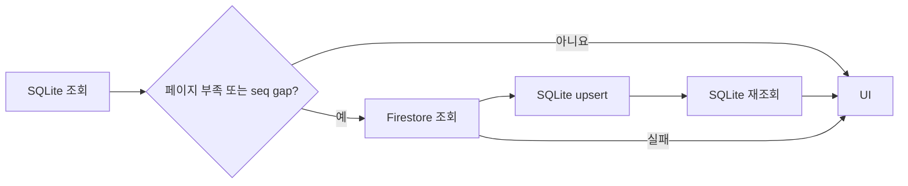
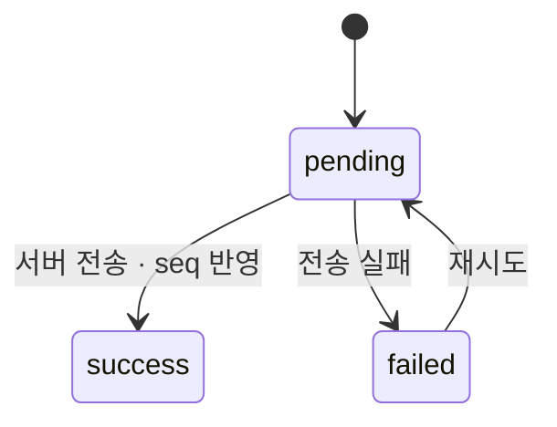

# PandyTalk

React Native로 개발해 [Google Play에 배포한](https://play.google.com/store/apps/details?id=com.cshchatapp) AI 채팅 앱입니다. 관리자 승인을 받은 사용자가 그룹 채팅과 DM에서 AI 비서 `@팬디`를 사용할 수 있습니다.

`React Native · TypeScript · React Query · SQLite · Firebase · SSE`

메시지 조회는 SQLite를 우선 사용하고 필요한 구간만 Firestore로 보충합니다. AI 답변은 첫 콘텐츠부터 SSE로 표시하며, 완료되지 않은 응답에는 Cloud Tasks 백업 경로를 둡니다.

이 프로젝트에서는 앱 화면뿐 아니라 Firestore 데이터 흐름, Firebase Functions, 푸시 알림, 배포·업데이트 경로까지 직접 구성했습니다. Google Play에 공개된 Android 앱은 관리자 승인 후 이용할 수 있습니다. 아래는 면접에서 설계 선택과 근거를 빠르게 확인할 수 있도록 채팅과 AI 응답에 집중한 요약입니다.

## 핵심 성과

| 문제 | 선택과 관찰 결과 |
| :--- | :--- |
| 채팅 메시지의 원격 조회 대기 | 개발 환경 각 5회 측정: Firestore 원격 fetch 평균 **286.74ms**, 데이터가 있는 **warm SQLite local query 평균 9.24ms** |
| AI 답변의 첫 노출 대기 | tool/search preflight를 제외한 6회 비교: non-stream **전체 완료 2,511.84ms**, SSE **첫 content chunk 771.17ms** |
| 실제 배포와 업데이트 | [Android 앱 배포](https://play.google.com/store/apps/details?id=com.cshchatapp), EAS Update 수신 코드와 CI 발행 경로 구성 |

두 시간 비교는 작은 표본에서 **서로 다른 경로·시점**을 관찰한 결과입니다. SQLite 값에는 cache miss의 Firestore 조회·저장·재조회와 화면 렌더링이 포함되지 않습니다. SSE 값은 전체 생성 속도 개선이 아니라 첫 콘텐츠를 받을 수 있는 시점입니다. 측정 조건과 원본: [SQLite](app/features/chat/perpomance.md) · [AI 스트리밍](docs/research/ai-stream-performance-results.md).

원격 조회 지연과 로컬 조회 시간을 분리해 보니 캐시가 이미 있는 채팅방에서 원격 요청을 반복하지 않을 이유가 분명해졌습니다. AI 응답에서는 완료 시간만 보면 사용자가 기다리는 구간이 드러나지 않아 첫 content chunk와 실제 첫 화면 출력도 별도로 기록했습니다.

## Engineering Highlights

### 1. Local-First Message Query

네트워크에 매번 의존하지 않도록 SQLite를 메시지 조회의 시작점으로 삼았습니다. React Query의 infinite query가 조회 결과를 화면 캐시로 관리하고, Firestore 구독으로 들어온 메시지도 SQLite에 저장한 뒤 캐시에 반영합니다.



페이지가 부족하거나 내부·cursor 구간의 `seq`가 연속적이지 않을 때만 Firestore에서 보충합니다. 원격 조회가 실패하면 기존 로컬 데이터를 반환합니다. 이 검사는 **조회한 페이지의 연속성**을 판단하며, 삭제된 메시지와 실제 누락을 구별하는 장치는 아닙니다. [동기화 설계와 한계](docs/engineering-log.md#메시지-조회와-동기화)

Firestore에서 보충한 결과를 곧바로 UI로 보내지 않고 SQLite에 저장한 뒤 다시 조회해, 과거 페이지 탐색의 반환 경로를 하나로 맞췄습니다. 실시간 구독은 로컬의 마지막 `seq` 이후 변경을 받아 캐시에 병합합니다. 로컬 저장에 실패해도 현재 화면에는 수신 메시지를 전달하지만, 그 경우 디스크 캐시는 나중에 다시 보정해야 합니다. 로컬에 데이터가 없거나 부족한 최초 조회는 원격 응답을 기다릴 수 있습니다.

선택의 대가는 동기화 정책의 복잡성입니다. SQLite의 최신 `seq`만 비교하면 중간의 빈 구간을 놓칠 수 있어 페이지 내부와 cursor 경계도 검사합니다. 반대로 gap이 매우 크면 최신 메시지 50개를 먼저 확보하므로, 과거의 빈 구간까지 한 번에 복구했다고 볼 수 없습니다. 이 경계는 상세 로그에 명시했습니다.

### 2. Reliable Message Delivery

전송 시 React Query 캐시와 SQLite에 `pending` 메시지를 먼저 표시합니다. Firestore 결과에 따라 서버 `seq`와 `success`를 반영하거나 `failed`로 표시해 재시도할 수 있게 했습니다.



원격 전송은 성공했는데 로컬 갱신이 실패한 경우를 전송 실패로 되돌리지 않습니다. 실패 갱신은 여전히 `pending`인 메시지에만 적용하고, 재시도는 같은 ID를 사용해 서버에 이미 저장된 메시지의 `seq`를 재사용합니다. [부분 실패 처리](docs/engineering-log.md#전송-상태와-부분-실패)

메시지 ID를 클라이언트에서 먼저 만들어 낙관적 표시와 서버 수신 결과를 같은 항목으로 병합합니다. Firestore에서는 채팅방의 마지막 `seq`와 새 메시지를 트랜잭션으로 기록합니다. 전송 결과가 늦게 도착하거나 로컬 기록이 부분적으로 실패하는 경우에도, 화면의 성공 상태가 뒤늦은 실패 처리로 역행하지 않도록 캐시와 SQLite 양쪽에서 조건을 둡니다.

### 3. AI Streaming과 백업 경로

`@팬디` 메시지가 저장되면 Firebase Function이 AI 메시지를 만들고 백업 태스크를 예약합니다. 앱은 인증된 HTTP/SSE 연결로 콘텐츠를 받아 화면에 점진적으로 표시합니다.

```text
사용자 메시지 → Firestore trigger / AI 메시지 생성
                         ├→ Firebase Function → SSE → 첫 chunk부터 UI 갱신
                         └→ Cloud Tasks 예약 → 미완료 상태 확인 후 대체 생성
```

클라이언트는 연결의 시작·완료·오류·화면 이탈 시 수명주기를 관리합니다. 백업 태스크는 30초 뒤 `success`/`failed` 상태를 확인하고 미완료 응답을 처리합니다. 실제 tool/search 경로 5회에서는 첫 화면 출력 평균 **12.91초**, 전체 완료 평균 **23.54초**였고, 대기 대부분은 서버의 첫 청크 준비 구간에 있었습니다. 백업 경로가 활성 SSE와 서버 전체에서 중복 실행되지 않음을 보장하는 lease는 구현돼 있지 않습니다. [설계와 제약](docs/engineering-log.md#ai-스트리밍과-백업) · [측정 원본](docs/research/ai-stream-performance-results.md)

HTTP Function은 Firebase ID token과 채팅방 멤버·질문자 정보를 확인한 뒤 스트림을 시작합니다. 클라이언트는 chunk를 버퍼에 누적해 화면에 순차적으로 표시하고, 연결 오류나 화면 이탈 시 열린 연결을 닫습니다. 서버는 생성된 최종 텍스트를 Firestore에 저장합니다. 연결이 시작되지 않았거나 완료되지 않은 경우를 위해 백업 태스크가 따로 실행되지만, 현재 상태 필드만으로 활성 연결의 소유자를 식별하지는 않습니다.

실제 경로 측정에서는 클라이언트가 첫 chunk를 받은 뒤 화면에 첫 글자가 나오기까지보다, 서버에서 첫 chunk가 준비될 때까지가 더 길었습니다. 그래서 격리 실험의 771.17ms를 앱 전체의 첫 화면 출력 시간처럼 쓰지 않고, tool/search를 포함한 12.91초 측정과 분리했습니다. 스트리밍은 기다림의 시작점을 앞당기는 UX 선택이며, 응답 생성 자체가 더 빨라졌다는 주장은 하지 않습니다.

## Architecture

채팅 경로는 화면과 저장소 접근을 분리합니다. React Query는 페이지·mutation 캐시를 담당하고, Service는 조회·동기화·전송 정책을 결정합니다. Local/Remote 모듈이 각각 SQLite와 Firestore에 접근하며, AI 처리와 푸시는 Firebase Functions에서 수행합니다.

```text
Screen → React Query hooks → Message Service → SQLite / Firestore
                                  Firestore trigger → Functions → SSE / Cloud Tasks / FCM
```

[구조 상세](docs/arch/architecture.md)

화면은 저장소 SDK를 직접 조작하지 않고 Hook을 통해 메시지 목록과 전송 상태를 사용합니다. Service가 로컬 우선 조회, 원격 보충, 재시도 정책을 모아 두었기 때문에 동일한 정책을 일반 조회와 재접속·구독 흐름에서 확인할 수 있습니다. Firebase Functions에는 멘션 생성 트리거, SSE HTTP 함수, 백업 Task가 각각 존재합니다.

## Testing

채팅의 Service, Local/Remote 모듈, Query·구독 Hook에 Jest 테스트가 있습니다. 로컬 페이지가 충분하면 원격 호출을 생략하는지, 데이터 부족이나 `seq` gap에서는 서버 데이터를 보충하는지, 원격 오류에서 로컬 결과를 반환하는지 확인합니다. 전송 테스트는 `pending → success/failed`, 기존 ID 재시도와 서버 성공 후 SQLite 갱신 실패를 다룹니다. 구독 테스트는 SQLite 저장 실패에도 현재 화면으로 메시지가 전달되는 경로를 포함합니다.

테스트 파일의 존재와 특정 커밋의 통과 여부는 구분합니다. 이번 README 수정에서는 Jest, 빌드, 기기 검증을 실행하지 않았습니다. [채팅 테스트 파일](app/features/chat/test) · [테스트·배포 근거](docs/engineering-log.md#테스트와-배포-근거)

## Tech Stack

| 역할 | 기술 |
| :--- | :--- |
| Client | React Native 0.81, React 19, TypeScript, Expo 54 Bare Workflow |
| Data | TanStack React Query, Redux Toolkit, SQLite, Firebase Firestore |
| Backend | Firebase Auth, Cloud Functions, Cloud Tasks, OpenAI |
| Realtime·Push | SSE, Firestore 구독, FCM |
| Delivery·Monitoring | EAS Build/Update, GitHub Actions, Firebase Analytics/Crashlytics |

## 배포·운영 범위

Android 앱은 Google Play에 등록돼 있고, 사용은 관리자 승인 계정으로 제한됩니다. 푸시 알림은 Functions의 FCM 발송 경로와 앱의 Firebase Messaging 설정으로 연결됩니다. 앱에는 EAS Update 확인·적용 코드가 있으며, GitHub Actions에는 `main`의 앱 코드 변경에 대해 정적 검사·테스트 후 EAS Update를 발행하는 작업이 정의돼 있습니다.

이 구성은 실제 앱을 배포하고 업데이트할 수 있는 경로를 보여줍니다. 다만 저장소의 설정만으로 최근 배포 횟수, 활성 사용자 수, CI 성공 이력까지 증명할 수는 없어 그런 운영 지표는 기재하지 않았습니다. 배포 화면과 코드 근거는 [Google Play](https://play.google.com/store/apps/details?id=com.cshchatapp) 및 [Engineering Log](docs/engineering-log.md#테스트와-배포-근거)에서 확인할 수 있습니다.

## 실행과 상세 기록

Node.js 20.19.4 이상과 Yarn, Android SDK 또는 Xcode, Firestore·Authentication·Functions가 활성화된 Firebase 프로젝트가 필요합니다. 설치 후 Metro 개발 서버를 시작합니다.

```bash
git clone https://github.com/951jth/pandytalk.git
cd pandytalk
yarn install
yarn start
```

Android의 `google-services.json`, iOS의 `GoogleService-Info.plist`, 앱 환경 변수는 사용자의 Firebase 프로젝트에 맞게 준비해야 합니다. OpenAI·Serper 키는 클라이언트에 넣지 않고 Functions Secret으로 설정합니다. 로컬 검사 명령은 `yarn verify`(lint, TypeScript, Jest)입니다. Android·iOS 개발 빌드 명령은 각각 `yarn android`, `yarn ios`입니다.

설계 판단·부분 실패·측정 한계는 [Engineering Log](docs/engineering-log.md)와 연결된 원본 문서에 기록했습니다. [기존 Notion Engineering Log](https://app.notion.com/p/3a859549cbc080bcb9f6ecbecbd7ae87?p=3a859549cbc080c9bf68c1155e975f7d&pm=c&t=3b759549cbc0802a906e00a9e5da28e6)
