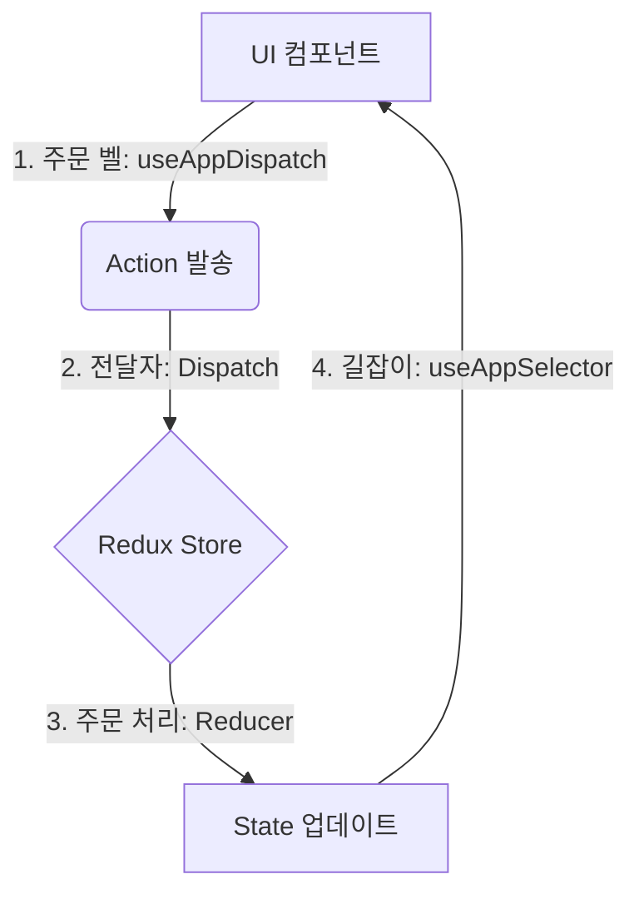

# 🏗️ Redux State Management Manual

이 문서는 우리 프로젝트의 리덕스(Redux) 상태 관리 흐름을 한눈에 파악하기 위한 가이드입니다. 복잡한 리덕스 구조를 **'창고 시스템'**에 비유하여 쉽게 설명합니다.

---

## 🧭 전체 흐름도 (The Big Picture)

리덕스는 데이터가 한 방향으로만 흐르는 **원형 시스템**입니다.



---

## 1️⃣ 단계: 데이터 저장소 설계 (Store & Types)
가장 먼저 창고가 어떻게 생겼는지 정의하고, 관리자가 어떤 권한을 가질지 설정합니다.

- **파일**: [store.ts](file:///c:/Users/DPC/workspace/csh_chatting/app/store/store.ts)
- **핵심 개념**:
    - **RootState (설계도)**: 창고 전체의 데이터 구조 타입. (지도 역할)
    - **AppDispatch (자격증)**: 비동기 주문까지 처리 가능한 관리자의 권한 타입.

---

## 2️⃣ 단계: 데이터 관리 단위 만들기 (Slice)
각 도메인(유저, 채팅, 시간 등)별로 창고의 '칸'을 나눕니다.

- **파일 예시**: [userSlice.ts](file:///c:/Users/DPC/workspace/csh_chatting/app/store/userSlice.ts)
- **구성 요소**:
    - **initialState**: 초기 상태 (데이터, 로딩 여부, 에러 메시지)
    - **reducers**: 단순하게 값을 바꾸는 주문 처리법 (예: 이름 변경)
    - **extraReducers**: 서버에서 데이터를 가져오는 등 시간이 걸리는 주문 처리법

---

## 3️⃣ 단계: 비동기 데이터 패칭 (Thunk)
외부 API(Firebase 등)에서 데이터를 가져올 때는 **Thunk**라는 특수 주문서를 사용합니다.

```typescript
// [Step 1] 주문서 만들기
export const fetchUserData = createAsyncThunk('user/fetch', async (id) => {
  const data = await userService.getProfile(id);
  return data; // 성공 시 fulfilled로 전달됨
});

// [Step 2] 상황별 처리 (Slice 내 extraReducers)
// - pending(기다리는 중): loading = true
// - fulfilled(성공): data = payload, loading = false
// - rejected(실패): error = message, loading = false
```

---

## 4️⃣ 단계: 컴포넌트에서 사용하기 (Hooks)
실제 화면(UI)에서 데이터를 읽거나 바꿀 때 사용합니다.

- **파일**: [reduxHooks.ts](file:///c:/Users/DPC/workspace/csh_chatting/app/store/reduxHooks.ts)
- **사용법**:
    - **데이터 읽기**: `const data = useAppSelector(state => state.user.data);`
    - **데이터 쓰기**: `const dispatch = useAppDispatch();` 👉 `dispatch(fetchUserData(id));`

---

## ✅ 새로운 기능 추가 체크리스트

1.  [ ] **Service 작성**: `features/` 폴더에서 API 호출 함수를 만듭니다.
2.  [ ] **Slice 생성**: `app/store/`에 새로운 Slice 파일을 만듭니다.
3.  [ ] **Store 등록**: [store.ts](file:///c:/Users/DPC/workspace/csh_chatting/app/store/store.ts)의 `reducer` 객체에 새 슬라이스를 등록합니다.
4.  [ ] **Thunk 작성**: 비동기 데이터가 필요하다면 Slice에 `createAsyncThunk`를 추가합니다.
5.  [ ] **UI 연결**: 컴포넌트에서 `useAppSelector`와 `useAppDispatch`를 사용합니다.

---

> [!TIP]
> **왜 이렇게 복잡한가요?**
> 초기 세팅은 번거롭지만, 앱이 커졌을 때 데이터가 어디서 어떻게 바뀌었는지 **완벽하게 추적**할 수 있어 유지보수가 매우 쉬워집니다. 특히 TypeScript의 자동 완성 기능을 100% 활용할 수 있습니다!
